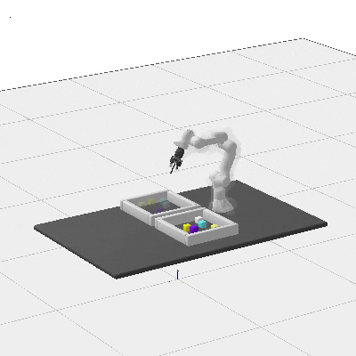
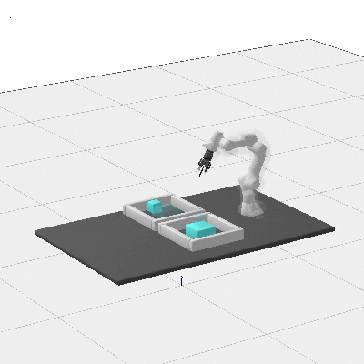
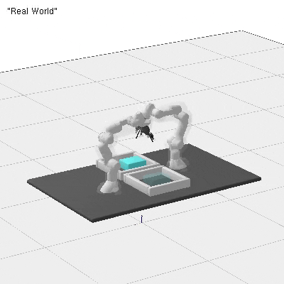
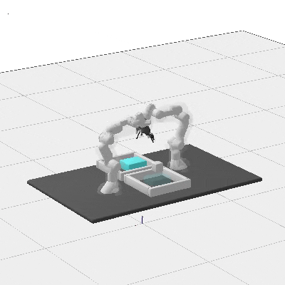
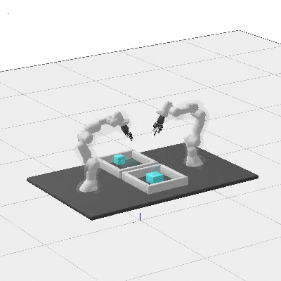

irobman_lab

# Installation 


The code depends on the code of [rai](https://github.com/vhartman/rai), [rai-robotModels](https://github.com/vhartman/rai-robotModels) and [rai-manip](https://github.com/vhartman/rai-manip).

```
mkdir your_folder
cd your_folder

git clone https://github.com/vhartman/rai.git
cd rai
# The following two commands depend on the config.mk -- see below
make -j1 printUbuntuAll    # for your information: what the next step will install
make -j1 installUbuntuAll  # calls sudo apt-get install; you can always interrupt

# Install pybind
sudo apt install --yes python3-dev python3 python3-pip
python3 -m pip install --user numpy pybind11 pybind11-stubgen

# TO AVOID "displayTrajectory" error, comment out lines 59-63 in rai/rai/ry/ry-LGP_Tree.cpp
make -j4
make -j4 tests bin  # (optional) 
make runTests      # (optional) compile and run the essential tests

cd ..
git clone https://github.com/yuezhezhang/rai-robotModels.git
git clone https://github.com/yuezhezhang/rai-manip.git 
git clone https://github.com/yuezhezhang/valentin_robot_stippling.git

# Install other dependencies
sudo apt install libspdlog-dev
sudo apt install libfmt-dev
```

The folder structure should be:
```
├── your_folder
│   ├── rai
│   ├── rai-robotModels
│   ├── rai-manip
│   ├── valentin_robot_stippling
```

Please change the rai path from `rai-fork` to `rai` in the Makefile in `rai-manip/PlanningSubroutines` and `rai-manip/Manip`.

Execution single arm pick and placing with
```
./x.exe -pnps true -mode single_arm

```

Execution single arm stacking with
```
./x.exe -pnps true -mode stacking_singlearm
```
Execution collaboration stacking with
```
./x.exe -pnpc true -mode stacking
```

Execution collaboration with single obj with
```
./x.exe -pnpc true -mode collaboration_single_obj
```

Execution collaboration with single obj and obstacle with
```
./x.exe -pnpc true -mode collaboration_single_obj_obstacle
```
Execution collaboration with single obj vertical with
```
./x.exe -pnpc true -mode collaboration_single_obj_vertical
```
# DEMOS

| Single Arm |stacking|
|---|---|
 |

| collaboration | collaboration|
|---|---|
 | 

| collaboration with obstacle|stacking with collaboration|
|---|---|
 | 