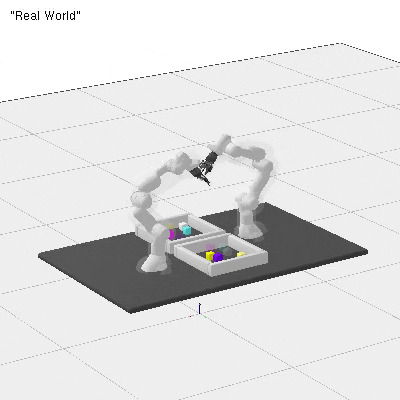

This repository aims to rerun the tagged code that was used for [Valentin](https://vhartmann.com/)'s paper ["Towards computing low-makespan solutions for multi-arm multi-task planning problems"](https://arxiv.org/abs/2305.17527). A writeup of the content can be found in Valentin's [blog](https://vhartmann.com/low-makespan-tamp/) and the repo that is in active development is [here](https://github.com/vhartman/24-data-gen/tree/master). 

# Installation 
The code depends on the code of [rai](https://github.com/vhartman/rai), [rai-robotModels](https://github.com/vhartman/rai-robotModels) and [rai-manip](https://github.com/vhartman/rai-manip).

```
mkdir your_folder
cd your_folder

git clone https://github.com/vhartman/rai.git
cd rai
# The following two commands depend on the config.mk -- see below
make -j1 printUbuntuAll    # for your information: what the next step will install
make -j1 installUbuntuAll  # calls sudo apt-get install; you can always interrupt

make -j4
make -j4 tests bin  # (optional) 
make runTests      # (optional) compile and run the essential tests

cd ..
git clone https://github.com/yuezhezhang/rai-robotModels.git
git clone https://github.com/yuezhezhang/rai-manip.git 
git clone https://github.com/yuezhezhang/valentin_robot_stippling.git
```

The folder structure should be:
```
├── your_folder
│   ├── rai
│   ├── rai-robotModels
│   ├── rai-manip
│   ├── valentin_robot_stippling
```

Please change the rai path from `rai-fork` to `rai` in the Makefile in `rai-manip/PlanningSubroutines` and `rai-manip/Manip`.

Compilation then works with
```
cd your_folder/valentin_robot_stippling
make -j8
```
Execution goes with
```
./x.exe
```

# Demos

| Random Search | Greedy Search |
|---|---|
 |  |


# irobman_lab
