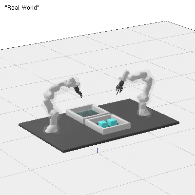
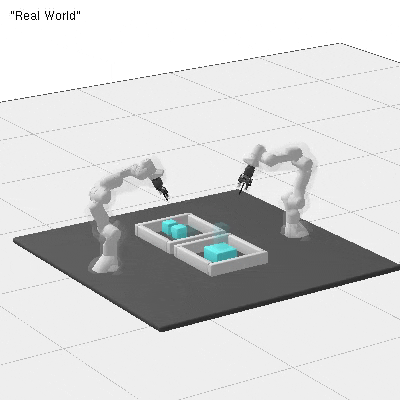

The project aims for two robotic arms to collaboratively grasp the same object.
We assume the use of two robotic arms working collaboratively to perform motion planning based on the given initial and target positions of the object to be grasped. 
To coordinate the motion planning, we first plan the movement of the first arm and save its waypoints. Then, based on the relative transformation between the two end-effectors, we generate the waypoints for the second arm and use KOMO to follow these waypoints. We designed various test scenarios for this approach, such as object transportation, stacking, and obstacle avoidance, all of which were successfully executed. 

# Installation 


The code depends on the code of [rai](https://github.com/vhartman/rai), [rai-robotModels](https://github.com/vhartman/rai-robotModels) and [rai-manip](https://github.com/vhartman/rai-manip).

```
mkdir your_folder
cd your_folder

git clone https://github.com/vhartman/rai.git
cd rai
# The following two commands depend on the config.mk -- see below
make -j1 printUbuntuAll    # for your information: what the next step will install
make -j1 installUbuntuAll  # calls sudo apt-get install; you can always interrupt

# Install pybind
sudo apt install --yes python3-dev python3 python3-pip
python3 -m pip install --user numpy pybind11 pybind11-stubgen

# TO AVOID "displayTrajectory" error, comment out lines 59-63 in rai/rai/ry/ry-LGP_Tree.cpp
make -j4
make -j4 tests bin  # (optional) 
make runTests      # (optional) compile and run the essential tests

cd ..
git clone https://github.com/yuezhezhang/rai-robotModels.git
git clone https://github.com/yuezhezhang/rai-manip.git 
git clone https://github.com/yuezhezhang/valentin_robot_stippling.git

# Install other dependencies
sudo apt install libspdlog-dev
sudo apt install libfmt-dev
```

The folder structure should be:
```
├── your_folder
│   ├── rai
│   ├── rai-robotModels
│   ├── rai-manip
│   ├── valentin_robot_stippling
```

Please change the rai path from `rai-fork` to `rai` in the Makefile in `rai-manip/PlanningSubroutines` and `rai-manip/Manip`.

Execution Single arm pick and placing with
```
./x.exe -pnps true -mode single_arm

```

Execution Single arm stacking with
```
./x.exe -pnps true -mode stacking_singlearm
```
Execution Collaborative stacking 2 boxes with
```
./x.exe -pnpc true -mode stacking_collaboration -obj_count 2
```

Execution Collaborative stacking 3 boxes with
```
./x.exe -pnpc true -mode stacking_collaboration -obj_count 3
```

Execution Collaborative grasp single box with
```
./x.exe -pnpc true -mode collaboration_obj -obj_count 1
```

Execution Collaborative grasp 2 boxes with
```
./x.exe -pnpc true -mode collaboration_obj -obj_count 2
```

Execution Collaborative grasp of a box while avoiding obstacles with
```
./x.exe -pnpc true -mode collaboration_single_obj_obstacle
```
Execution Collaborative grasp single obj vertical with
```
./x.exe -pnpc true -mode collaboration_single_obj_vertical
```

To transform the saved ppms into an mp4, run in terminal:
```
cd video
ffmpeg -framerate 20 -i filename%05d.ppm -c:v libx264 -crf 25 -vf "scale=400:400,format=yuv420p" -movflags +faststart videoname.mp4
```
To transform the mp4 into a high-quality gif, run:
```
gifski -o videoname.gif videoname.mp4
```

# DEMOS

| Single-arm grasping of multiple objects using komo |Single-arm stacking using komo|
|---|---|
 |

| Collaborative grasp of a box using ST-RRT* | Collaborative grasp of a box using KOMO|
|---|---|
 | 

| Collaborative grasp of a box while avoiding obstacles using ST-RRT* |Collaborative stacking two boxes uisng KOMO|
|---|---|
 | 

|Collaborative stacking two boxes uisng KOMO|
|---|
 |<img src="./video/bin_picking/stacking_co.gif" alt="005" 